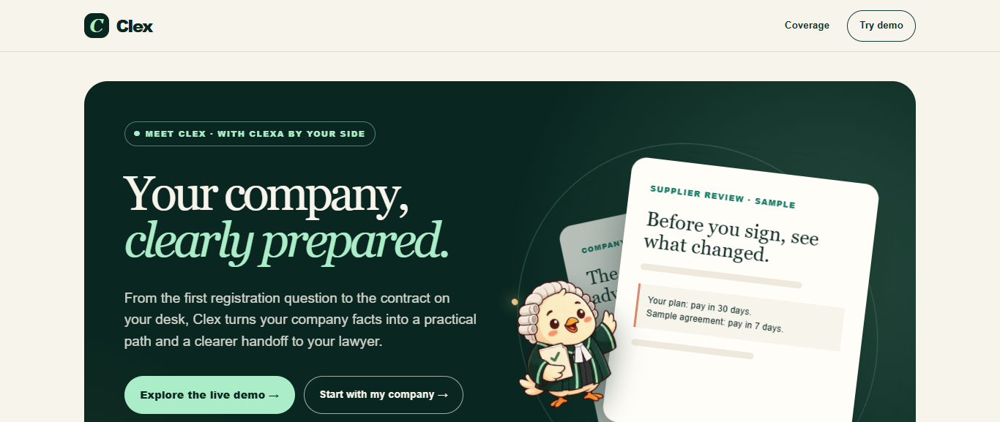
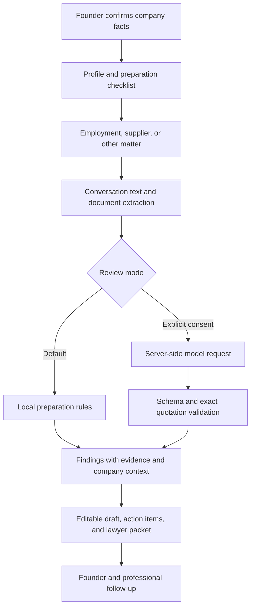

# Clex

### Your company, clearly prepared.

Clex helps founders carry their company's context from the first registration question to the contracts on their desk. Confirm the facts, organize the next steps, and review business documents with the company's actual situation in view.

**[Try the live demo](https://lex-company-counsel-web.vercel.app/)** · **[Judge walkthrough](docs/JUDGE_WALKTHROUGH.md)** · **[Implementation evidence](docs/STATUS.md)**



## Why we built it

Building a company means making decisions with legal consequences long before a founder has a legal team. Choosing how to register, bringing in a cofounder, hiring a first employee, and signing a supplier agreement all raise questions that depend on the company's location, stage, activities, and previous decisions.

That context can end up scattered across forms, emails, conversations, and contracts. Each new issue becomes another exercise in explaining the business. A checklist can miss what has changed. An agreement can look reasonable in isolation while contradicting what a supplier promised.

Clex grew from a simple idea: legal support should develop an understanding of the company over time. The workspace keeps confirmed facts, unanswered questions, documents, and preparation tasks together. Clexa, the illustrated guide, helps the founder move through that journey and prepare clearer questions for professional review.

## What it feels like to use

Start with the company. Tell Clex where it operates, what it does, and how far it has progressed. Answers stay editable, and unknown facts remain unknown. The saved profile shapes registration preparation and a starting checklist.

Then bring in a business matter: an employment question, a supplier agreement, or another issue. Add the relevant conversation and document. Clex uses the company's context to explain what needs attention and points to the text behind each finding.

The supplier demo makes this concrete:

```text
Company context   → A synthetic bakery preparing a supplier relationship
Intended payment  → Net 30 days after accepted delivery
Sample agreement  → Payment within 7 days of invoice
Clex review       → Exact passages, the mismatch, and why it matters
Founder action    → Prepare an editable response and questions for counsel
```

Drafting the response leaves the finding open. Adding another source marks the earlier review as stale. The founder can see what has been checked and what still needs attention.

## Explore the demo

Open **[Clex on Vercel](https://lex-company-counsel-web.vercel.app/)** and choose **Click demo answers**. The sample company, conversations, agreements, and certificate are synthetic.

1. **Establish company context.** On each of the five question pages, choose **Fill this page with demo answers**, review the answers, and press **Next**. At the review step, choose **Save company answers**.
2. **Prepare for registration.** Use **Fill this page with demo details** on each registration page, review the details, and save. Continue through **Get my registration pack → Download registration pack (PDF)**. The **Use sample certificate → Complete registration** path demonstrates recording registration progress with synthetic evidence; it does not register a real company.
3. **Review a supplier matter.** From the dashboard, open **Contracts & suppliers**. Add the sample conversation and document, then ask Clex to compare them. Inspect the excerpts and the explanation tied to the company's facts.
4. **Prepare a response.** Ask for an editable draft and check that unresolved findings remain open. Adding a source makes the earlier review stale until another check runs.

The instant local review is the default. Select **Use live AI for this review** only when you want to send the supplied sources and company details to the configured model provider.

**For a short pitch:** prepare the synthetic company workspace first and focus on the supplier comparison. The complete guided registration journey takes several minutes. See the [walkthrough](docs/JUDGE_WALKTHROUGH.md) for narration and demo boundaries.

## What is implemented

| Area | Current behavior |
| --- | --- |
| Company context | Saved company answers, confirmed facts, profile revisions, and explicit unknowns |
| Starting workflow | Registration preparation, downloadable preparation pack, assessment, and checklist |
| Business matters | Separate employment, supplier/commercial, and other matter workspaces |
| Sources | Private TXT, DOCX, and text-based PDF uploads, plus supplied conversation text |
| Review | Local preparation logic and an optional model review with exact quotation checks |
| Follow-through | Persistent matter conversations, editable drafts, action items, and printable lawyer packets |
| Review state | Drafts leave findings open; new sources make prior reviews stale |
| Company isolation | Server authorization and PostgreSQL row-level security |

**Evidence snapshot — 27 September 2026:** the project records successful Render browser checks of company setup, supplier evidence comparison, saved conversations, drafts, and review-state changes. A consented OpenAI review succeeded with synthetic sources. These are bounded prototype checks; see [STATUS.md](docs/STATUS.md) for environments, commits, failures, and remaining work.

## How it works



The web application handles company and matter requests through server routes. PostgreSQL stores profiles, sources, analyses, drafts, and conversations. Uploaded documents live in the database rather than the app's temporary filesystem. The ordinary application database role is subject to row-level security.

Matter analysis currently runs within a server request. A separate worker exists for earlier background jobs, but it is not the execution path for the current matter review.

### Decisions that keep the review inspectable

- **Evidence must come from a source.** Model quotations are checked against the supplied text. A structured response alone is insufficient.
- **Company access is enforced by the application and database.** A client-supplied company ID does not establish permission.
- **External processing requires an explicit choice.** Configuring a model does not automatically send every review to it.
- **Failures stay visible.** A failed model request is recorded as failed and does not silently become a successful local review.
- **Review state follows source changes.** New sources make earlier analysis stale. Deleting a source removes the matter's analysis, draft, and saved-chat derivatives.
- **Legal content has a separate publication gate.** The content system binds approval to a specific version and requires a distinct reviewer. The included jurisdiction packs remain draft research pointers.

## Tech stack and credits

| Layer | Tools | Role |
| --- | --- | --- |
| Application | TypeScript, Node.js, Next.js, React | Typed domain code, server routes, and interface |
| Styling | Tailwind CSS | Layout and visual styling |
| Persistence | PostgreSQL, `pg` | Company records, private document storage, and row-level security |
| Validation | Zod | Input and output schemas |
| Documents | Mammoth, `pdf-parse`, `pdf-lib` | DOCX extraction, PDF text extraction, and PDF generation |
| Model APIs | OpenAI Responses; Anthropic Messages adapter | Optional external review; OpenAI has recorded live verification, Anthropic does not |
| Quality checks | Vitest, Playwright, ESLint, TypeScript compiler | Automated tests, browser checks, linting, and type checking |
| Development | pnpm, `tsx`, Git, GitHub | Workspace management, TypeScript scripts, and version control |
| Preview hosting | Render | Web service and PostgreSQL |
| AI development tools | OpenAI Codex, Hoplite | Assistance with implementation, debugging, and iteration |

These are existing third-party tools and services used by Clex. Exact package versions are recorded in the workspace manifests and [pnpm lockfile](pnpm-lock.yaml). The `supabase/migrations` directory contains SQL migrations; its name does not imply that the preview uses Supabase hosting or authentication.

## AI use disclosure

**During development:** Codex and Hoplite assisted with implementation, debugging, and iteration. The repository contains automated checks and records of browser validation. Passing software checks does not establish the legal accuracy of generated material.

**Inside the product:** the default immediate review uses local preparation rules. A separate opt-in review sends supplied sources and company details to the configured provider. Model output must match a defined schema, and quoted passages must exist in the sources. The interface distinguishes review modes and reports provider failures.

**In the demonstration:** company details, source conversations, agreements, and the sample certificate are synthetic. Findings, response drafts, and preparation packets are unreviewed material for a founder and their adviser.

## Run it locally

### Prerequisites

- Node.js **22 or newer**, as required by `package.json`.
- pnpm **11.19.0**, the version pinned by the workspace.
- A running PostgreSQL instance; the documented local setup uses PostgreSQL 16.
- A local PostgreSQL administrator connection able to create a database and roles.

A model API key is optional. Local preparation works with `LLM_PROVIDER=none`.

### 1. Install dependencies

From the repository root:

```sh
pnpm install --frozen-lockfile
```

### 2. Create the local database

Set `PG_ADMIN_URL` to your local administrator connection. In PowerShell:

```powershell
$env:PG_ADMIN_URL = 'postgres://postgres@localhost:5432/postgres'
pnpm db:setup
Copy-Item .env.example apps/web/.env.local
```

Or in a POSIX shell:

```sh
export PG_ADMIN_URL='postgres://postgres@localhost:5432/postgres'
pnpm db:setup
cp .env.example apps/web/.env.local
```

Replace the example connection with the credentials for your local instance. Copy the example environment file only for a new setup; preserve an existing `.env.local`.

`db:setup` creates `lex_dev`, applies migrations, and prepares the application roles. On a fresh database it prints connection strings: copy `DATABASE_URL` and `APP_DATABASE_URL` into `apps/web/.env.local`. Keep that output private. On an existing database, the script preserves role passwords; retain your existing connection strings.

The web server must use the restricted `lex_app` connection in `APP_DATABASE_URL`. The privileged `DATABASE_URL` is for setup and migrations.

### 3. Start the application

```sh
pnpm dev
```

Open **http://localhost:3000**. Each browser receives a guest workspace. Keep its cookies to retain access to that workspace.

### Optional model configuration

In `apps/web/.env.local`, set:

```dotenv
LLM_PROVIDER=openai
LLM_MODEL=YOUR_AVAILABLE_MODEL_ID
LLM_API_KEY=YOUR_SERVER_SIDE_API_KEY
```

Use a model available to your account that supports the adapter's structured output requirements. The repository also implements `LLM_PROVIDER=anthropic`; a successful live Anthropic review is not recorded. Restart the server after configuration changes. Users still opt in for each external review.

### Configuration reference

| Variable | Purpose | Default or requirement |
| --- | --- | --- |
| `DATABASE_URL` | Privileged connection for setup and migrations | Required |
| `APP_DATABASE_URL` | Restricted application connection | Required |
| `APP_ENV` | Application environment | `development` |
| `APP_URL` | Application origin | `http://localhost:3000` |
| `LLM_PROVIDER` | `none`, `openai`, or `anthropic` | `none` |
| `LLM_MODEL`, `LLM_API_KEY` | Server-side model configuration | Required for external review |
| `UPLOAD_MAX_MB` | Upload size limit | `10` |
| `DOCUMENT_MAX_PAGES` | PDF page limit | `50` |
| `GENERATION_TIMEOUT_SECONDS` | Generation timeout | `90` |
| `SESSION_TTL_HOURS` | Guest session lifetime | `336` |
| `WORKER_DATABASE_URL` | Connection for the separate worker | Only for worker use |

See [.env.example](.env.example) for additional settings. CLI commands such as `db:migrate` read shell environment variables; do not assume they load the web application's `.env.local`.

## Validation

```sh
pnpm typecheck
pnpm lint
pnpm test
pnpm build
```

Set `PG_ADMIN_URL` in the shell before running the full test suite. The suite creates an isolated test database and roles and removes them after the run. Without that variable, database integration tests are skipped with a notice, so a passing run does not establish database isolation.

Recorded checks cover company isolation, document handling, exact excerpt validation, fabricated quotation rejection, deletion of derived data, and review-state behavior. See [acceptance criteria](docs/ACCEPTANCE_TESTS.md) and the dated [evidence log](docs/STATUS.md) for coverage and results.

`pnpm eval:legal` evaluates content-pack cases. A passing evaluation of draft or synthetic content does not establish qualified legal review. The `test:e2e` script exists, but use the evidence log to determine which browser journeys have actually been exercised.

## What we learned while building

**Company context has to survive the whole journey.** Registration answers become useful when a later supplier or employment question can refer back to them. That drove the saved profile and visible company facts in matter workspaces.

**A generated answer needs an inspectable basis.** Exact quotations and explanations tied to company facts make findings easier to question. They also expose missing evidence instead of letting a fluent answer hide it.

**State is part of the explanation.** Drafting a response, resolving a finding, and reviewing new evidence are different events. The interface and stored state need to reflect those differences.

**Live integrations reveal failures that mocks miss.** Documented testing exposed PDF parser loading issues and an OpenAI output-schema mismatch. Those findings led to parser handling changes and stricter structured output. The Vercel preview was then checked with synthetic TXT and PDF uploads and an instant supplier review.

## Current limits and next steps

Clex is a working hackathon prototype for legal preparation. It does not provide a licensed legal service or establish an attorney-client relationship.

- **Legal coverage:** Nigeria, the UK, the US, European countries, and China are target markets. Selecting a market does not establish reviewed coverage. The five packs remain draft research pointers.
- **Professional review:** generated drafts and packets are unreviewed. Qualified pack approval, reviewer invitations, and a complete professional review workflow remain outstanding.
- **Progress and dates:** dashboard percentages describe tracked tasks. Calendar dates are planning placeholders, not verified filing deadlines or a legal compliance score.
- **Guest access:** clearing cookies or losing a session can remove access to saved work. Account recovery is not implemented.
- **Documents and integrations:** scanned PDFs need OCR, which is not implemented. Conversation material is supplied by the user; the preview does not provide direct Slack or Gmail sign-in.
- **Hosting:** Vercel serves the judge preview; Render remains a working fallback and hosts the shared disposable PostgreSQL database. The recorded free database expiry is 26 October 2026; durable hosting and backups need further work. Browser sessions are tied to each hostname, so an existing Render session does not automatically appear in a new Vercel browser session.

Next priorities are a professionally reviewed pack with a narrow scope, a complete review handoff, account recovery, stronger document-abuse controls, durable hosting, and broader accessibility checks. See the [backlog](docs/BACKLOG.md).

## Repository guide

```text
apps/web/               Next.js interface, server routes, and matter review
apps/worker/            Separate worker for existing background jobs
packages/domain/        Company, matter, content, and environment schemas
packages/db/            Database access, tenant boundaries, and setup scripts
packages/content/       Preparation rules, source registry, and pack evaluation
supabase/migrations/    Versioned PostgreSQL migrations
scripts/                Development and evaluation helpers
docs/                   Walkthroughs, acceptance criteria, and evidence
```

| Document | Use it for |
| --- | --- |
| [Judge walkthrough](docs/JUDGE_WALKTHROUGH.md) | Demo path, narration, and synthetic-data disclosure |
| [Implementation status](docs/STATUS.md) | Dated implementation and verification evidence |
| [Implementation plan](IMPLEMENTATION_PLAN.md) | Product scope, architecture, and delivery plan |
| [Jurisdiction packs](docs/JURISDICTION_PACKS.md) | Coverage and legal-content review policy |
| [Acceptance tests](docs/ACCEPTANCE_TESTS.md) | Expected behavior and verification requirements |
| [Render preview](docs/RENDER_PREVIEW.md) | Deployment setup; check the status log for later changes |
| [Build and submission guide](docs/CODEX_BUILD.md) | Submission preparation and historical review notes |

## Ownership and licence

No open-source licence has been selected for Clex. Repository visibility is not a licence grant; third-party dependencies retain their own licences. The development plan calls for fresh core implementation and prohibits copying the earlier Compliance-AI-Scanner implementation or the ArbLex proposal into this product.
